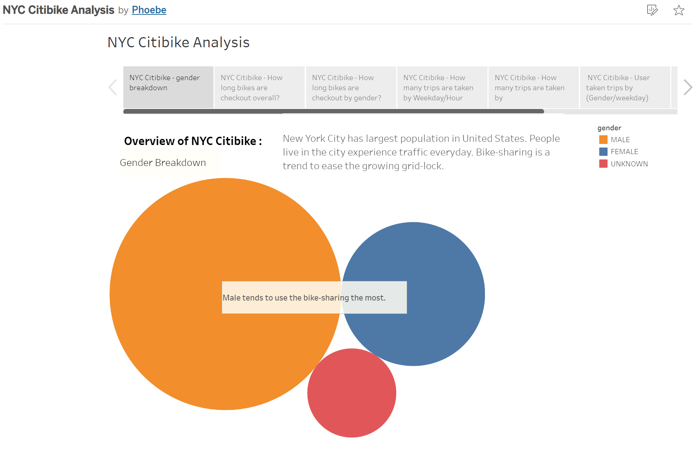
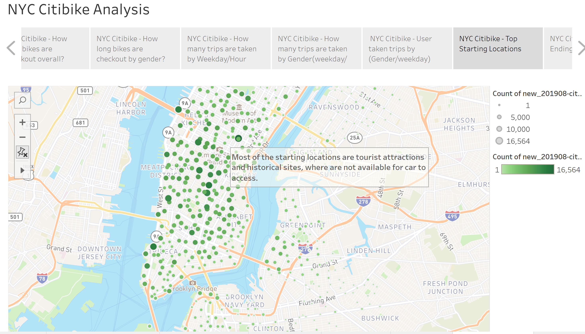
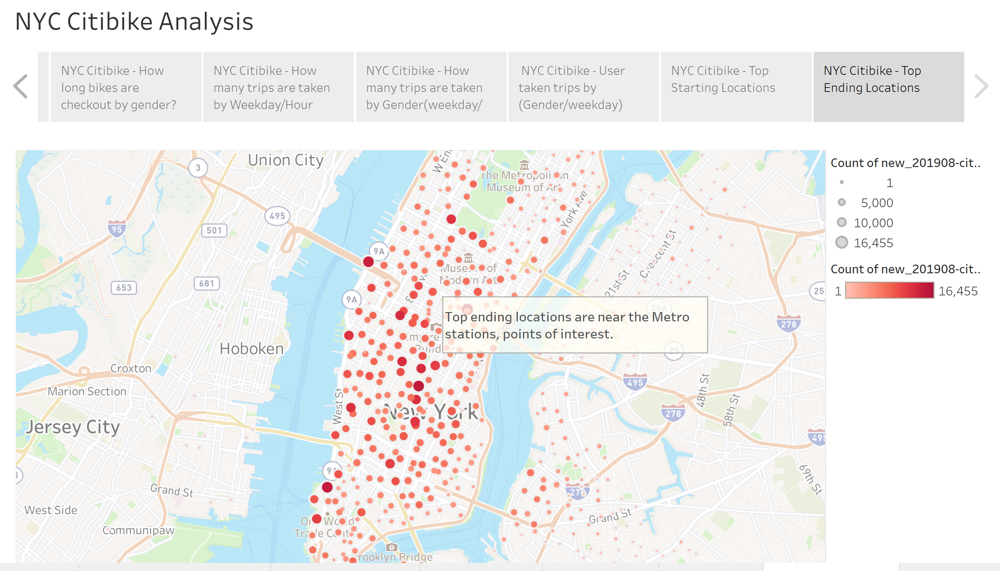

# Bike-Sharing Business Analysis

## Overview of the analysis
Bike-Sharing business analysis uses Tableau visualization to present a business proposal for a bike-sharing company. We create worksheets, dashboards, and stories to visualizae key data base on the New York Citi Bike dataset. Our goal is to use Tableau visualiztion tools to prepare a presentation and analysis to explore the Bike-sharing business.

## Results 
- How long bikes are checked out for all riders and genders. 

  - Gender Breakdown for Bike-sharing: Overall riders, Male has a larger percentage to use bike-sharing.

  

   - Checkout Times for Users: Mostly bikes are checked out within an hour. Specifically, the bikes return peak-hour is in 5minutes for all riders.

  

  - Checkout Times by Gender: Most of the Male and Female are likely to checkout the bikes within an hour, peak-hour at 5minutes.  
  
  

- How many trips are taken by the hour for each day of the week, for all riders and genders.A breakdown of what days of the week a user might be more likely to check out a bike, by type of user and gender.

  - Trips by Weekday for Each Hour: The peak-hour on weekdays are 7am-9am and 4pm-7pm, which could tell the trips are taken during working hours.  

  
  
  - Trips by Gender (Weekday per Hour): Comparing the weekdays checkout time by gender, Male and Female has the same trend. Monday to Friday are likely to check out bikes. And the peak-hours for checkout time is during core time.

  
  
  - User Trips by Gender by Weekday: In this graph, we could tell most of the Male subscribe users are likely to checkout bikes through out the whole week.Comparing to the subsbribe users, customers are taking less trips for the week.

  
  
  
- What are the top starting locations and ending locations for bike-sharing riders?

  - Top Starting Locations: Most of the starting locations are tourist attractions and historical sites, where might not available for car to access.

  
  
  - Top Ending Locations: The top ending locations are most likely near the Metro stations or points of interest, which are convenience for riders to transfer with other transportation.

  

### Resources
Additional Resources Link:
https://public.tableau.com/app/profile/phoebe7195/viz/NYCCitibikeAnalysis_16485472581470/NYCCitibikeanalysis

## Summary 
According to Bike-sharing analysis, we can conclude that NYC Citibike program has a good prospect for business. Based on the checkout time per hour, per weekday, and uses which shows that most of the riders are using bike-sharing to commute or travel. We are successfully using powerful visualization tools to support our business proposal and created a story to perform our results. For future analysis, we will suggest to create a dashborad and add additional worksheets about biking repair, and how bike utilization by using Tableau visualization. 

___________________________________________________________________________________________________________________________________________________

Contributor: Phoebe J. Miao
Contact： 
